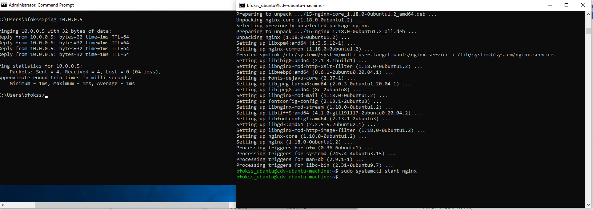
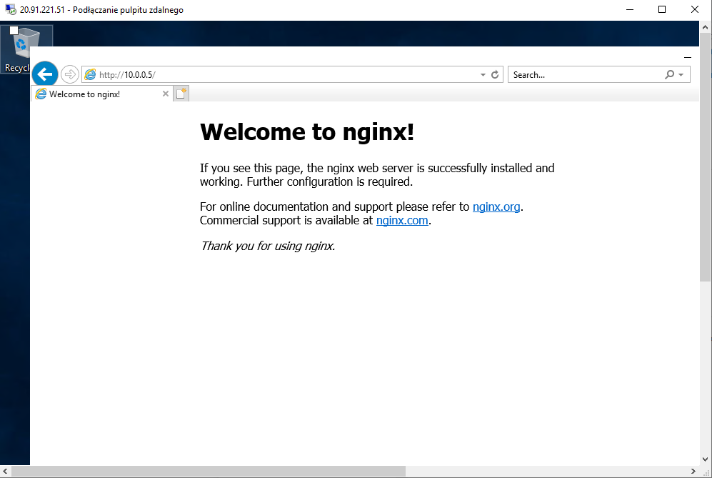
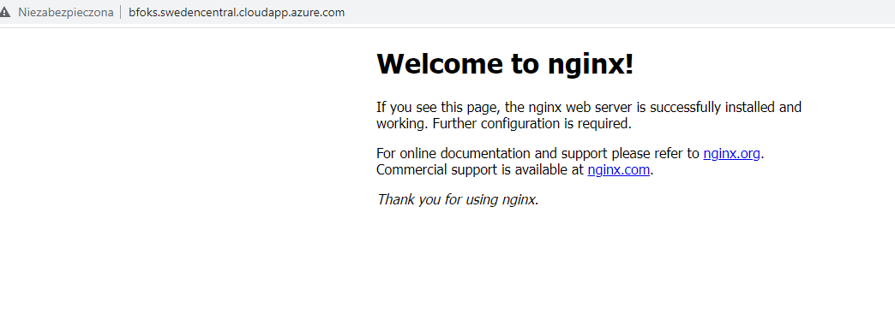

# This is 1_lab folder

Tasks:
<ol>
<li>Create virtual network on Azure</li>
<li>Create windows virtual machine on Azure</li>
<li>Create ubuntu virtual machine on Azure</li>
<li>Install nginx on ubuntu virtual machine</li>
<li>Start nginx service</li>
<li>Connect to nginx from windows virtual machine</li>
</ol>

___

*Extra tasks*
<ol>
<li>Publish 80 port on ubuntu virtual machine on Azure</li>
<li>Connect to nginx on local machine</li>
</ol>

___

Results:

<i> Ping Windows VM with Linux VM </i>

  

<i> VM Windows nginx connection </i>

  

<i> Local Windows nginx connection </i>

