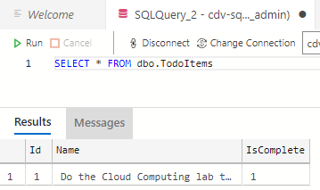
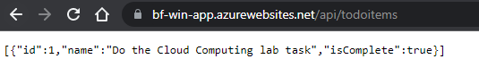

# This is 3_lab folder
Tasks:
<ol>
<li>Publish app</li>
<li>Create app service on Azure</li>
<li>Deploy app to Azure</li>
<li>Test app</li>
</ol>

___

Additional informations:
<ul>
    <li> To access this application reach to: <a href="https://bf-win-app.azurewebsites.net/api/todoitems">https://bf-win-app.azurewebsites.net/api/todoitems</a></li>
</ul>

___

Results:

<i>Azure Data Studio Query result:</i>

<i>Website showing GET list of everything request:</i>

